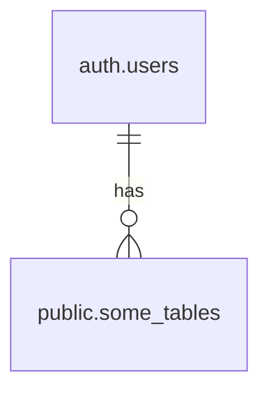

:::note
解決策から見たい方は[こちら](#解決策)を参照。
:::

# 背景

Supabaseを利用中、`public`スキーマ内に作成したテーブルに、Supbase Authで認証したユーザの情報を保持したいと考えていた。

Supabaseのダッシュボードを見ていたら、Supbaseの認証で利用しているテーブル`auth.users`のidを紐づけられそうだった。

そこで自身が作成した`user_id`と`auth.users`の`id`を紐づけてリレーションを作成した。


上記の設定をER図にすると、以下のイメージ。



リレーションが作成でき、アプリケーションからデータのinsertができた。

しかし登録したデータをユーザ情報と共にselect文で取得をしようとしたところ、以下のエラーが表示され取得に失敗した。

```
{
    "code": "PGRST100",
    "details": "unexpected "u" expecting "sum", "avg", "count", "max" or "min"",
    "hint": null,
    "message": ""failed to parse select parameter (auth.users(*))" (line 1, column 33)"
}
```

# 原因

Supabaseの仕様として、Supabaseで自動生成される`auth.users`等のテーブルに対し、クライアントからアクセス可能な権限を提供していない。
それにより、selectなどで`auth.users`テーブルのデータを取得しようとするとクエリが失敗してしまう。

解決策を探すと、権限を付与する方法と、`public`内に同期するテーブルを作り`trigger`で同期する手順の2つがあった。

- 同期テーブルを作る方法

https://stackoverflow.com/questions/77751173/getting-auth-users-table-data-in-supabase

- 権限を付与する方法

https://qiita.com/suin/items/f26cf3f3928c6c9eef35

今回は以下の理由より、同期テーブルを作る方法で対応した。

- 同期テーブルを作る方法は[公式ドキュメント](https://supabase.com/docs/guides/auth/managing-user-data)で公開されている方法
- `auth.users`の権限を触るのはSupbaseの推奨設定を変更する為、あまりよくなさそう


# 解決策

Supabaseの公式ドキュメントに手順を参考に進める。

https://supabase.com/docs/guides/auth/managing-user-data

具体的な手順は以下の通り。

1. `auth.users`テーブルの情報と同期する`profiles`テーブルを新規作成
2. `atuh.users`にデータが作成されたら、そのデータを`profiles`に同期するトリガー作成

## 1. `auth.users`テーブルの情報と同期する`profiles`テーブルを新規作成

はじめに`auth.users`テーブルとユーザ情報を同期する、`profiles`テーブルを新規作成する。


```sql
create table public.profiles (
  id uuid not null references auth.users on delete cascade, # auth.usersのユーザが削除されたら、このテーブルのデータも削除する
  first_name text,
  last_name text,

  primary key (id)
);

alter table public.profiles enable row level security;
```

`id`カラムは、`auth.users`テーブルのユーザ情報と同期する必要があるため、`auth.users`のデータが削除された時に`prfiles`のデータも削除する参照制約を付与している。

## 2. `atuh.users`にデータが作成されたら、そのデータを`profiles`に同期するトリガー作成

次に`auth.users`テーブルにデータが作成されたら、`profiles`テーブルにユーザ情報を同期する`function`を作成する。

```sql
create function public.handle_new_user()
returns trigger
language plpgsql
security definer set search_path = ''
as $$
begin
  insert into public.profiles (id, first_name, last_name)
  values (new.id, new.raw_user_meta_data ->> 'first_name', new.raw_user_meta_data ->> 'last_name');
  return new;
end;
$$;
```

具体的な処理は、ユーザが追加されたら`auth.users`テーブルの`id`と、`raw_user_meta_data`テーブルの`first_name`と`last_name`を、`profiles`テーブルにインサートするというものである。

最後に上記の`function`を呼び出す`trigger`を作成する。

```sql
create trigger on_auth_user_created
  after insert on auth.users
  for each row execute procedure public.handle_new_user();
```

こちらで設定は完了。

Supbase認証で新しくユーザが追加されるたびに、`profiles`にそのユーザが追加されるようになる。

