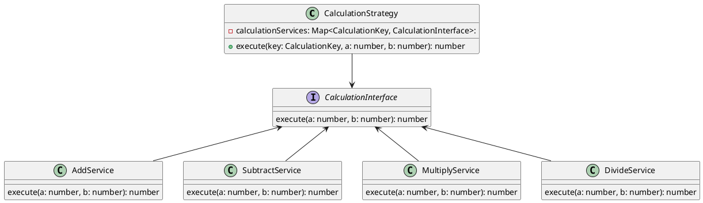

# はじめに

Angular にはデフォルトで強力な DI 機能が備わっている。この DI 機能は、Java の Spring Framework のように、インターフェースと実装クラスを分けて、状況に応じて実装クラスを切り替えることができ、開発において非常に便利な機能である。

サーバサイド開発 ではこの DI 機能が実装されているフレームワークが多く、Strategy Pattern を実装することが多いが、Angular でも同様のことができる。

この記事では、Angular の DI 機能を使って、Angular の Service コンポーネントで Strategy Pattern を実装する方法を紹介する。

# Strategy Pattern とは

Strategy Pattern は、プログラムへの入出力(=インターフェース)が同じで、中身のアルゴリズムだけが異なる場合に使われるデザインパターンである。
例として四則演算が挙げられる。四則演算は、入力が 2 つの数字の組み合わせ、出力が 1 つの数字となり、計算方法が足し算か引き算かなどで中身のアルゴリズムが変わる。

Strategy Pattern を適応可能な例として四則演算がある。その場合、四則演算の概念を `interface`とし、足し算、引き算などのアルゴリズムを`interface`を実装したクラスとして扱う。

そして Strategy サービスで実装するアルゴリズムを切り替える。

四則演算で Strategy Pattern を実装すると、クラス図は以下のようになる。



# 実装

与えられた 2 つの数字の計算をする Web 画面を作成し、その計算方法を Strategy Pattern で切り替える機能を実装する。

動作は以下のようになる。`Result`の値がセレクトボックスで指定した四則演算の種類に応じて変わることが確認できる。


利用したソースコードは Github を参照

https://github.com/sey323/angular-strategy-pattern-sample

ライブデモは以下の URL から確認できる

https://stackblitz.com/~/github.com/sey323/angular-strategy-pattern-sample

## 環境

- Angular v17.2

## 1. 四則演算を行う Strategy Pattern を利用したサービスの実装

改めて、今回作成する Strategy Pattern を利用したサービスのクラス図は以下の通り。


はじめに、四則演算を表す `CalculationInterface` を作成する。`execute`が計算を行う処理で、引数として`a`と`b`を受け取り、戻り値として計算結果を返す。

```typescript:src/app/services/calculation-interface.ts
export interface CalculationInterface {
  execute(a: number, b: number): number;
}
```

その後、`CalculationInterface`の実装クラスとして、`AdditionService`、`SubtractionService`、`MultiplicationService`、`DivisionService`を作成する。

```typescript:src/app/services/calculation-services.ts
import { Injectable } from '@angular/core';
import { CalculationInterface } from './calculation-interface';

@Injectable({
  providedIn: 'root',
})
export class AddService implements CalculationInterface {
  execute(a: number, b: number): number {
    return a + b;
  }
}

@Injectable({
  providedIn: 'root',
})
export class SubtractService implements CalculationInterface {
  execute(a: number, b: number): number {
    return a - b;
  }
}

@Injectable({
  providedIn: 'root',
})
export class MultiplyService implements CalculationInterface {
  execute(a: number, b: number): number {
    return a * b;
  }
}

@Injectable({
  providedIn: 'root',
})
export class DivideService implements CalculationInterface {
  execute(a: number, b: number): number {
    return a / b;
  }
}
```

`@Injectable`デコレータをつけることで、Angular の DI 機能を利用でき、コンストラクタでサービスを注入することができる。

インターフェースとクラスの実装ができたら、処理を切り替えるための Strategy サービスを作成する。

はじめに上記の四則演算の種類を示すキーを作成する。

```typescript:src/app/services/calculation-key.ts
export enum CalculationKey {
  ADD = 'add',
  SUBTRACT = 'subtract',
  MULTIPLY = 'multiply',
  DIVIDE = 'divide',
}
```

Strategy サービスではプロパティとして、四則演算の種類を示すキーとそれに対応する実装を紐づける。

```typescript:src/app/services/calculation-strategy.ts
import { Injectable } from '@angular/core';
import { CalculationKey } from './calculation-key';
import { CalculationInterface } from './calculation-interface';
import {
  AddService,
  DivideService,
  MultiplyService,
  SubtractService,
} from './calculation-services';

@Injectable({
  providedIn: 'root',
})
export class CalculationStrategiesService {
  private calculationServices: Map<CalculationKey, CalculationInterface>;

  constructor(
    private addService: AddService,
    private subtractService: SubtractService,
    private multiplyService: MultiplyService,
    private divideService: DivideService
  ) {
    // (1)四則演算の種類のEnums(CalculationKey)と計算を行うサービスを紐づける
    this.calculationServices = new Map<CalculationKey, CalculationInterface>();

    this.calculationServices.set(CalculationKey.ADD, addService);
    this.calculationServices.set(CalculationKey.SUBTRACT, subtractService);
    this.calculationServices.set(CalculationKey.MULTIPLY, multiplyService);
    this.calculationServices.set(CalculationKey.DIVIDE, divideService);
  }

  // (2)入力された四則演算の種類に応じて、計算を行うサービスを切り替える
  execute(calculationKey: CalculationKey, a: number, b: number): number {
    return this.calculationServices.get(calculationKey)!.execute(a, b);
  }
}

```

(1)の箇所のコンストラクタの初期化時に`Map<CalculationKey, CalculationInterface>`で`CalculationKey`とサービスを紐づけている。
たとえば`CalculationKey.ADD`は足し算を意味するキーなので、それを実装している`AddService`を紐づけている。

(2)の箇所の`execute`メソッドで、四則演算の種類に応じてサービスを切り替えて実行する。`this.calculationServices.get(calculationKey)`で入力した Key に対応するサービスを取得し、`execute`メソッドで計算を行う。

これにより、条件分岐を使わずに四則演算の種類に応じてサービスを切り替えることができる。

## 2. 四則演算の種類を切り替える Web 画面の実装

`CalculationStrategiesService`を利用した Web 画面を作成する。

はじめに Web 画面を作成する。セレクトボックスで四則演算の種類を選択し、「Calculate」ボタン押すことで、指定した四則演算の種類に応じて計算を行う。

```html:src/app/app.component.html
<div>
  <h1>Calculation Sample</h1>
  <div>Method: <span>{{selectedCalculation}}</span></div>

  <select [(ngModel)]="selectedCalculation">
    <option [value]="calculationKeyEnums.ADD">ADD</option>
    <option [value]="calculationKeyEnums.SUBTRACT">SUBTRACT</option>
    <option [value]="calculationKeyEnums.MULTIPLY">MULTIPLY</option>
    <option [value]="calculationKeyEnums.DIVIDE">DIVIDE</option>
  </select>

  <div>
    <input type="number" [(ngModel)]="firstNumber" />
    {{ selectedCalculation === calculationKeyEnums.DIVIDE ? '÷' : selectedCalculation === calculationKeyEnums.MULTIPLY ? '×' : selectedCalculation === calculationKeyEnums.ADD ? '+' : '-' }}
    <input type="number" [(ngModel)]="secondNumber" />
  </div>

  <button (click)="calculate()">Calculate</button>

  <div>Result: <span>{{result}}</span></div>
</div>
```

次にコンポーネントクラスで計算処理を実装する。

```typescript:src/app/app.component.ts
import { Component } from '@angular/core';
import { CalculationKey } from './services/calculation-key';
import { CommonModule } from '@angular/common';
import { FormsModule } from '@angular/forms';
import { CalculationStrategiesService } from './services/calculation-strategies.service';
@Component({
  selector: 'app-root',
  standalone: true,
  imports: [CommonModule, FormsModule],
  templateUrl: './app.component.html',
})
export class AppComponent {
  calculationKeyEnums = CalculationKey;
  selectedCalculation: CalculationKey = CalculationKey.ADD;
  firstNumber = 10;
  secondNumber = 5;
  result = 0;
  calculationStrategiesService: CalculationStrategiesService;

  constructor(
    private _calculationStrategiesService: CalculationStrategiesService
  ) {
    this.calculationStrategiesService = _calculationStrategiesService;
  }

  calculate() {
    this.result = this.calculationStrategiesService.execute(
      this.selectedCalculation, // (1)実行時に選択された四則演算の種類のキーを指定する
      this.firstNumber,
      this.secondNumber
    );
  }
}
```

`calculate`メソッドの(1)の箇所で、選択されている四則演算の種類のキー(`selectedCalculation`)を引数として与え、Strategy サービスで実行する四則演算の種類を切り替える。

これによりコンポーネントでは if や switch 文を使わずに、与えられたセレクトボックスの種類に応じてサービスを切り替えることができる。

# おわりに

Angular の DI 機能を使って、Strategy Pattern を実装する方法を紹介した。今回の様なシンプルな処理だと条件分岐を使っても実装でも問題ないが、システムが大きくなりロジックが複雑な処理になると保守性が下がってしまう。

そのような場合には、この様に Strategy Pattern を使いビジネスロジックを切り出すことで、コードの保守性を落とさないまま柔軟に変更できるようになる。
